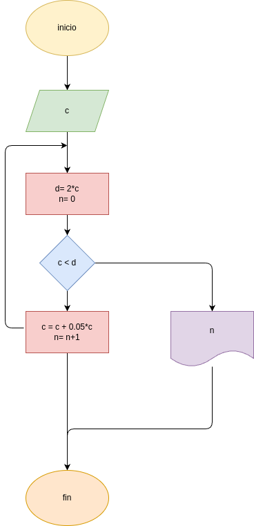

### programa para calcular el interes compuesto
programa en python para ingresar un capital y imprimir en cuantos meses se duplica con un interes del 0,5%

## analisis

### variables de entrada
x = ingrese el capital que quieras imvertir
### procesamiento

while c < d:
    c = c + (c*0.05)
    n = n + 1   
    print("c", c)

## diseño

